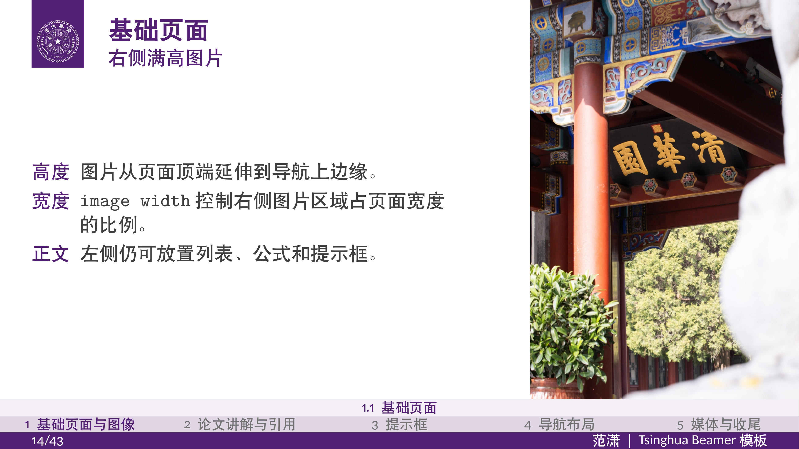
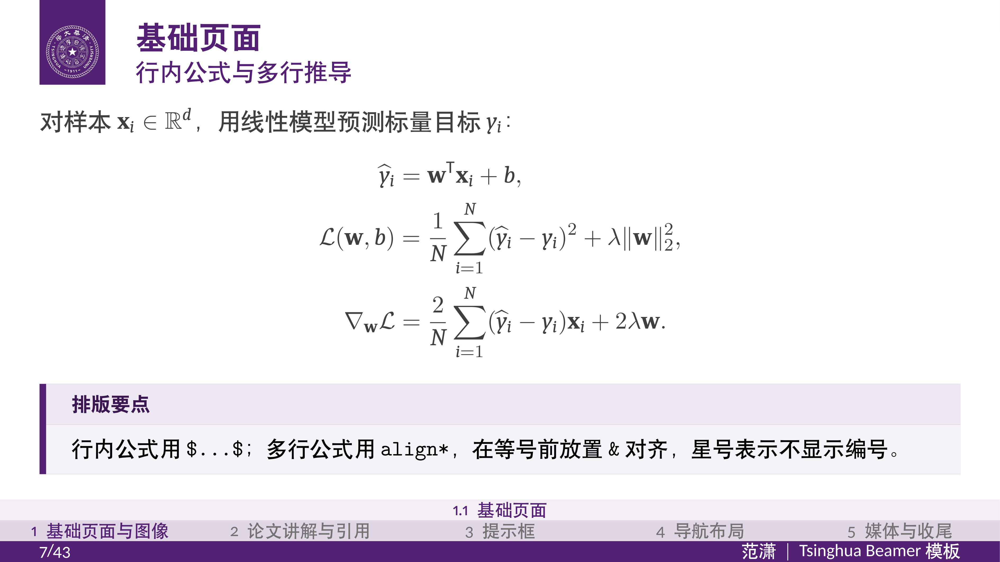
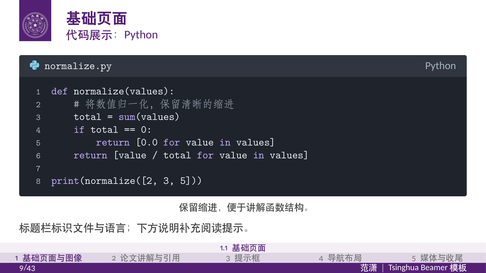
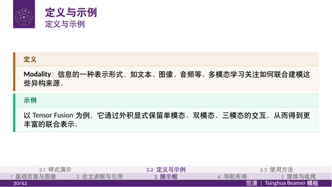
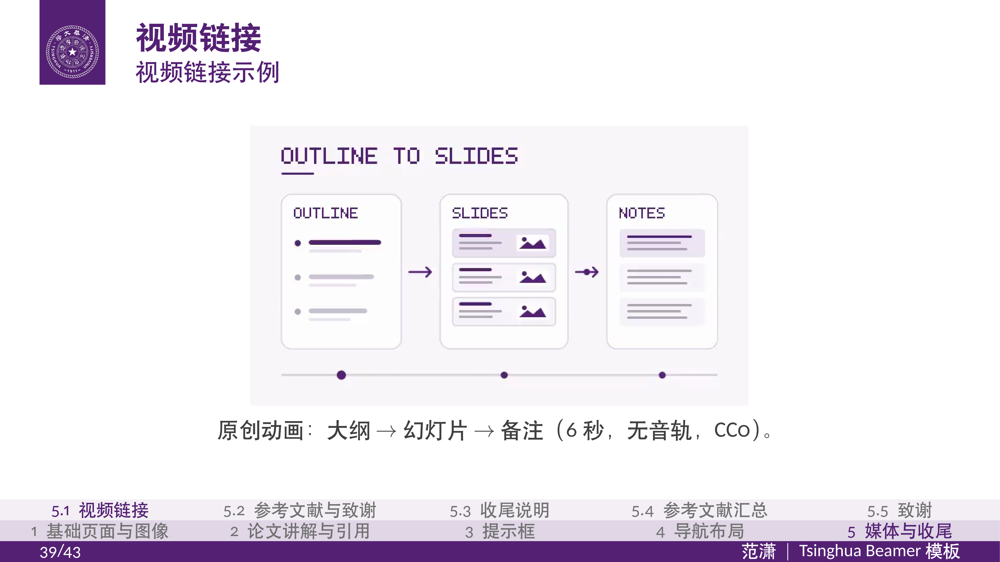
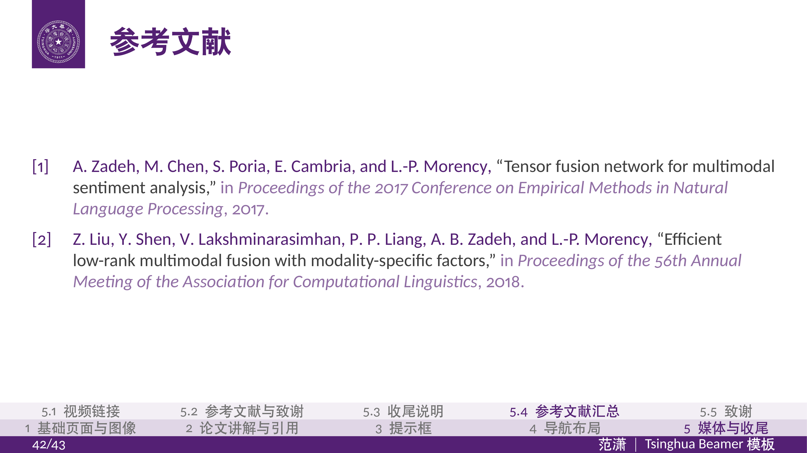
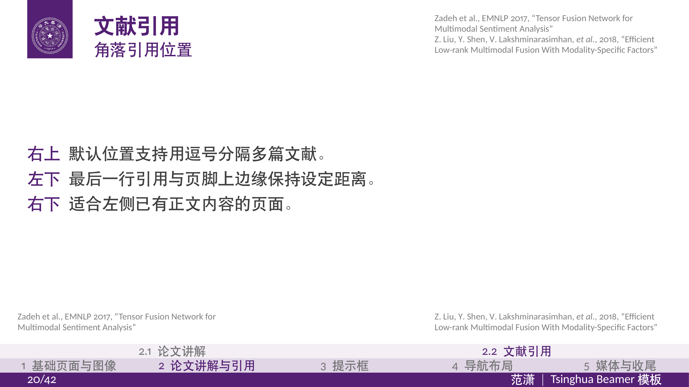

<div align="center">
  <h1>
    <picture>
      <source media="(prefers-color-scheme: dark)" srcset="assets/campus-beamer-logo-white.svg">
      
    </picture>
  </h1>
  <h2>简洁、优雅，面向 Agent 的学术 Beamer 模板</h2>
  <p>
    <a href="https://github.com/AnikiFan/campus-beamer/releases/latest"></a>
    <a href="https://github.com/AnikiFan/campus-beamer/actions/workflows/ci.yml"></a>
    <a href="LICENSE"></a>
    <a href="https://github.com/AnikiFan/campus-beamer/releases"></a>
  </p>
  <p>把思路和备好的素材交给 agent，生成排版完整、带讲解备注的 PDF 与 PowerPoint。</p>
  <p>
    <a href="README.en.md">English</a> ·
    <a href="docs/usage.md">使用手册</a> ·
    <a href="CONTRIBUTING.md">贡献指南</a> ·
    <a href="docs/releases.md">版本与发布</a>
    <br>
    <a href="SECURITY.md">安全政策</a> ·
    <a href="ACCESSIBILITY.md">无障碍说明</a> ·
    <a href="#致谢">致谢</a>
  </p>
</div>


## 示例页面

`example.tex` 是版式与功能演示；完整的 `example.pdf` 和 `example.pptx` 请前往
[GitHub Releases](https://github.com/AnikiFan/campus-beamer/releases) 下载。
Release 中的示例 PPTX 已写入逐页 PowerPoint 备注，可直接在演讲者视图查看。
下面选取几页代表性画面，帮助快速了解模板支持的版式：

<div align="center">
  <p>
    
    
    
    
  </p>
  <p>
    
    
    
    
  </p>
  <p>
    
    
  </p>
</div>

缩略图来自当前示例 PPTX 转换后的幻灯片图像；视频页还包含 PPTX 内嵌视频的首帧预览。其中的校徽、校名和校园图像适用
[素材来源与使用声明](assets/README.md)。

默认学校配置为清华；配色、校徽和校名标志集中在
[`theme/campuscolor.sty`](theme/campuscolor.sty)。主题实现和变量使用通用的 `campus` 命名。
`example.tex` 展示模板的版式与功能；自己的汇报由 agent 根据你的需求生成。
本项目不是学校官方发布的模板。

## 推荐使用方式：提供思路与素材

1. 克隆仓库或解压源码包，在支持本地文件读写和命令执行的 agent 中打开项目。
2. 提前把素材放进 `materials/`：例如从 arXiv 下载的论文 LaTeX 源码包、论文 PDF、图片或自己的实验结果。
3. 在根目录的 [`outline.md`](outline.md) 中填写基本信息、演讲目标和草稿大纲。内容大纲可使用自然语言、笔记或章节列表。
4. 向 agent 发出制作请求：

> 根据大纲制作 PPT。

agent 按 [`AGENTS.md`](AGENTS.md) 读取大纲和素材，整理章节、每页主旨和讲解备注，供你审阅。
确认大纲后，它会生成汇报源码、检查实际页面，并导出 `build/main.pdf` 和 `build/main.pptx`。
大纲中可注明标题、听众、时长、演讲目标、素材路径、链接和待确认事项。

[`STYLE.md`](STYLE.md) 定义默认汇报风格，**可按你的需求修改**：
包括每页内容密度、正文与备注的分工、备注详细程度、引用位置及日期格式。
agent 在制作和修订时应用这些偏好；当前大纲中的明确要求优先。
论文源码包的解压，以及正文、图注、图片和文献的阅读与整理，也由 agent 完成。
需要外部检索、补充素材或扩展内容时，agent 会先说明拟议内容和依据，供你确认。

修改汇报时，可向 agent 提供反馈，它会更新大纲、正文及备注并重新构建。
涉及内容变化的修订先确认大纲，排版和拼写修正可直接进行。

PPTX 自动保留原生章节分节、标题与作者，以及副标题、课题组、指导教师、汇报日期等文档属性。

**PPTX 每页是一张渲染图像，文字不能作为 PowerPoint 原生文本编辑。**
请把修改意见交给 agent，或直接编辑生成的 `.tex` 源码。
`make` 负责已有源码的编译与转换；从思路到内容的写作由 agent 完成。

## 环境与功能示例

制作环境需要 **GNU Make、uv、XeLaTeX、latexmk、biber** 及模板的 TeX 包／字体。
可以使用本机的 TeX Live / MacTeX，或使用 [Docker 环境](docs/docker.md)；
详细安装步骤见[安装说明](docs/installation.md)。使用 `make doctor` 检查本地环境。
`uv run --frozen` 按 `uv.lock` 自动建立 `.venv`，首次下载 Python 依赖需要联网。

```bash
make doctor              # 检查环境
make draft MAIN=example  # 查看示例的逐页预览与排版报告
make MAIN=example        # 构建 build/example.pdf 和 build/example.pptx
make                     # 有 main.tex 时构建自己的汇报，否则构建 example.tex
```

[`example.tex`](example.tex) 是供人和 agent 查阅的功能演示，正文在 `chapters/`，
包含章节页、图像、公式、引用、代码窗口、导航与视频。要直接查看完整 PDF/PPTX，请使用
[GitHub Releases](https://github.com/AnikiFan/campus-beamer/releases) 中的附件；agent 根据汇报目标挑选适合的版式，
另行生成你的内容。全部文档类选项及默认值也列在示例入口中，见[选项说明](docs/class-options.md)。

- 固定 16:9 布局，支持中英文；默认全主色章节页，清华配置下为紫色。
- 自动适配图片、公式、论文讲解页及[终端风格代码窗口](docs/usage.md#代码与终端窗口)。
- `biblatex` / `biber` 文献管理，角落引用与已引用文献汇总；可按需使用 [DBLP 与引用数工具](docs/literature.md)。
- PDF → PPTX 保留跳转、外部链接、本地视频与逐页备注；PDF 和 PPTX 的视频首帧预览需要 FFmpeg。
- `make draft` 提供逐页预览和排版诊断，帮助 agent 精简、拆页并检查溢出。

<details>
<summary>查看引用与导航示例</summary>



</details>

`materials/` 用于个人素材，`build/` 保存构建产物。个人汇报源码、素材和备注默认仅保存在本地；
目录和分发规则见[使用手册](docs/usage.md#快速开始)。
VS Code、Overleaf 和命令行用法见[环境说明](docs/workflows.md)。

## 更换学校

只编辑 [`theme/campuscolor.sty`](theme/campuscolor.sty)：

- 修改按功能命名的 `maincolor`、`tipcolor`、`notecolor`、`alertcolor`、`examplecolor`、`definitioncolor`。
- 页脚使用 `maincolor` 背景和白色文字。
- 封面采用主色斜边版式，颜色跟随 `maincolor`；显式设置为 `\titlebackground{primary}`。
- 将深色／浅色底上的校徽、校名标志路径指向自己的透明素材。

示例个人信息在 `chapters/metadata.tex`；自己的汇报信息由 agent 根据大纲写入 `chapters/talk/metadata.tex`。
照片和插图由各自的章节文件直接引用。
章节页默认用 `primary`，也可在正文中指定图片或 `white`。布局几何留在主题实现内；
配置字段和素材尺寸要求见[学校配置说明](docs/usage.md#更换学校)。

## 常用命令

```bash
make pdf                       # 编译 PDF，成功后自动清理 LaTeX 中间文件
make DPI=200                   # 较小的 PPTX，适合预览
make draft PAGES=3,8-10         # 局部页面排版检查
make test                      # Python 回归测试
make literature QUERY="论文标题" # 搜索 DBLP 候选
make bibtex DBLP_KEY=conf/...    # 下载单条 BibTeX 和引用次数到 build/literature/
make citations DOI=10.../...    # 查询引用次数、来源与日期
make check-theme               # 在隔离目录编译主题测试例
make dist                      # 生成可作为独立仓库使用的源码 ZIP
make version                   # 查看 pyproject.toml 中的项目版本
make release                   # 测试、构建演示并生成带校验和的版本化发行包
make clean                     # 手动清理失败构建留下的中间文件
make help                      # 查看全部入口
```

## 项目结构

```text
.
├── outline.md                  汇报草稿大纲
├── example.tex                 版式与功能演示
├── main.tex                    agent 生成的汇报入口（本地文件）
├── materials/                  预置素材目录，放入的文件仅本地保留
├── chapters/                   演示正文与片段；talk/ 为 agent 生成的正文
├── theme/                      样式与学校配置
│   ├── campusbeamer.cls        文档类：语言、文献及通用配置入口
│   ├── beamerthemecampus.sty    主题版式与命令
│   ├── campuscode.sty          代码与终端窗口
│   └── campuscolor.sty          功能配色与学校标志配置
├── bibliography/               文献数据库，默认 refs.bib
├── assets/                     模板自带的标志、图片与示例视频
├── docs/                       详细手册、安装说明、环境用法与预览
├── docker/                     Dockerfile、构建上下文清单与容器入口
├── tools/                      转换、预览、校验与打包工具
│   ├── tests/                  Python 回归测试
│   └── fixtures/               主题测试源码
├── .github/                    CI、Issue 和 PR 模板
└── build/                      PDF、PPTX、*.notes.json 等构建产物
```

演示入口留在根目录，样式集中在 `theme/`；`.latexmkrc` 自动配置 TeX 搜索路径，
正文使用 `\documentclass{campusbeamer}`，从项目根目录运行 `make` 即可构建。
复制模板时保留 `theme/` 和 `.latexmkrc`。
GitHub Actions 读取仓库根目录下的 `.github/workflows/`。

## 参与改进

欢迎报告可复现的排版、转换和导航问题，也欢迎贡献文档及学校配置示例。
提交前请阅读 [CONTRIBUTING.md](CONTRIBUTING.md)，附最小示例与必要日志；
不要把自己的完整汇报、私人备注或编译中间文件提交到源码仓库。

版本变化记录在 [CHANGELOG.md](CHANGELOG.md)。`make dist` 只收录
`tools/package_source.py` 中逐一登记的公开文件，新增文件默认不进入源码包。
`make release` 生成本地校验用的 `build/releases/campus-beamer-v<版本>-release.zip`。
GitHub Release 会将源码 ZIP、`example.pdf`、`example.pptx`、发行说明和 SHA-256 校验文件分别作为附件，
方便单独下载；始终构建 `example.tex`。GitHub 的 **Release Please** 工作流维护发行 PR，合并后创建 Release 并上传发行包，也保留手动构建入口；配置与发布步骤见
[发布指南](docs/releases.md)。

## 许可与素材

项目源码采用 **GPL-3.0-or-later**，见 [LICENSE](LICENSE)。
默认清华校徽、校名、组合标志及校园图像来自[清华大学视觉形象识别系统](https://vi.tsinghua.edu.cn/)
和[清华大学深圳国际研究生院官方图库](https://www.sigs.tsinghua.edu.cn/en/7453/list.htm)，部分经过裁剪。
校徽、校名及相关标志涉及清华大学的注册商标与其他权利，除本模板的演示文稿用途外请勿用于其他用途。
这些图像不适用项目的 GPL 许可证，本声明也不构成校方授权或背书。
演示视频 `assets/presentation_demo.mp4` 为程序生成的原创几何动画，单独采用 CC0-1.0，
生成源码与授权说明见 [素材清单](assets/README.md#原创演示视频)。
目前暂时无法联系到相关权利人或摄影者，尚未取得明确的素材许可或核实逐张摄影者署名。
如有侵权、署名遗漏或来源标注问题，请随时通过 [xiaofan140@gmail.com](mailto:xiaofan140@gmail.com)
或本仓库 Issue 联系维护者；我们会及时核实，并补充署名、更正说明、替换或移除相关素材。
本联系声明不替代权利人许可。完整声明及文件清单见 [assets/README.md](assets/README.md)。
预览图来自本项目 PDF，其中的清华素材适用同一声明。

## 致谢

感谢以下项目的作者与贡献者：

- **工程实践**：[TongjiThesis 同济论文模板](https://github.com/TJ-CSCCG/TongjiThesis)。
  本项目参考了其文档类选项、文献配置入口、章节文件组织，以及 Make 构建、环境检查和
  命令行、VS Code、Overleaf、GitHub Actions 的使用说明，结合 Beamer 汇报流程独立实现。
- **视觉风格**：[THU-beamer-template](https://github.com/FangWHao/THU-beamer-template)
  和 [TongjiBeamer](https://github.com/Kian-Chen/TongjiBeamer)。本模板的风格在这两个项目的
  基础上改进，并根据本项目的排版与功能需求进一步调整。
- **早期模板来源**：[college-beamer](https://github.com/liu-qilong/college-beamer)
  和 Federico Zenith 创建的 [SINTEF Presentation](https://www.overleaf.com/latex/templates/sintef-presentation/jhbhdffczpnx)。
  本模板的早期基础可追溯到这两个项目；college-beamer 也明确注明其源自 SINTEF Presentation。
